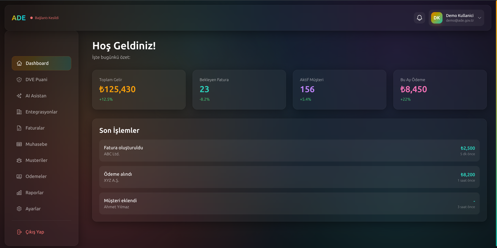
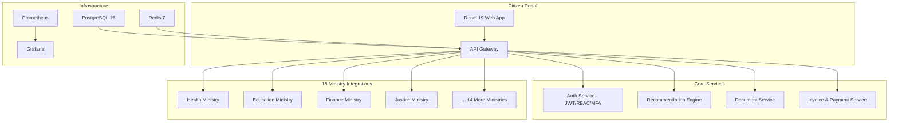

<div align="center">
  
  <br><br>

# ADE - Smart Government Ecosystem

### Intelligent E-Government Platform with 18 Ministry Integrations and Proactive Citizen Services
### 18 Bakanlik Entegrasyonlu ve Proaktif Vatandas Hizmetleri Sunan Akilli E-Devlet Platformu

[](https://ade.ailydian.com)
[]()
[]()
[]()
[]()

</div>

---

## Preview

<div align="center">
  
  <br><em>ADE Landing - "A Government Advisor in Every Citizen's Pocket" | 18 Ministry Integrations | 7/24 Availability | 80% Automation | 99.95% Uptime</em>
</div>

<br>

<div align="center">
  
  <br><em>Citizen Dashboard - Total Revenue, Pending Invoices, Active Customers, Monthly Payments with Recent Transaction History</em>
</div>

---

## Executive Summary

ADE (Smart Government Ecosystem) is an enterprise-grade digital government platform that unifies 18 Turkish ministry APIs into a single citizen-facing portal with a proprietary proactive recommendation engine. Rather than forcing citizens to navigate complex bureaucratic structures, ADE intelligently surfaces relevant government services, automates tax filings, manages SGK (social security) premiums, and handles utility payments -- all from a single dashboard.

The platform targets the $18B global e-government market with a B2G (business-to-government) subscription model for municipalities, government agencies, and citizen service centers. With Turkey's 85 million citizens and the government's aggressive digitization agenda, ADE addresses a massive underserved market. The platform achieves 80% process automation, reducing citizen wait times from days to minutes and cutting municipal operational costs by up to 60%.

ADE's technical architecture features a NestJS 10 backend with 18 ministry integration adapters, a React 19 citizen portal with real-time data processing, event-driven architecture for live government data synchronization, and full KVKK/GDPR compliance with audit trails. The Prometheus + Grafana observability stack ensures 99.95% uptime for mission-critical government services.

## Yonetici Ozeti

ADE (Akilli Devlet Ekosistemi), 18 Turk bakanlik API'sini tescilli proaktif oneri motoruyla tek bir vatandas portalinda birlestiren kurumsal sinif bir dijital devlet platformudur. Vatandaslari karmasik burokratik yapilarda gezmeye zorlamak yerine, ADE ilgili devlet hizmetlerini akillica one cikarir, vergi beyannamelerini otomatiklestirir, SGK primlerini yonetir ve fatura odemelerini tek bir panodan gerceklestirir.

Platform, belediyeler, devlet kurumlari ve vatandas hizmet merkezleri icin B2G (devlete satis) abonelik modeliyle 18 milyar dolarlik kuresel e-devlet pazarini hedeflemektedir. Turkiye'nin 85 milyon vatandasi ve hukumetin agresif dijitallestirme gundemiyle ADE, buyuk ve yetersiz hizmet alan bir pazara hitap etmektedir. Platform %80 surec otomasyonu saglamakta, vatandas bekleme surelerini gunlerden dakikalara indirmekte ve belediye operasyonel maliyetlerini %60'a kadar dusurmektedir.

ADE'nin teknik mimarisi; 18 bakanlik entegrasyon adaptorune sahip NestJS 10 arka ucu, gercek zamanli veri isleme ile React 19 vatandas portali, canli devlet veri senkronizasyonu icin olay guden mimari ve denetim izleriyle tam KVKK/GDPR uyumlulugu icermektedir.

---

## Key Metrics

| Metric | Value |
|--------|-------|
| Ministry Integrations | 18 |
| Service Availability | 7/24 |
| Process Automation | 80% |
| System Uptime | 99.95% |
| Total Revenue Tracked | 125,430+ TRY (demo) |
| Active Customers | 156+ (demo) |
| Dashboard Modules | 10 (Invoice, Accounting, Payments, Reports, etc.) |

---

## Revenue Model & Projections

### Business Model

B2G municipal and agency subscriptions:
- **Small Municipality** (pop. <50K): $2,000/month - Core citizen services portal
- **Medium Municipality** (pop. 50K-500K): $10,000/month - Full 18-ministry integration + analytics
- **Large Municipality** (pop. 500K+): $25,000/month - Enterprise features + custom integrations
- **Government Agency**: $50,000/month - Multi-region deployment + priority support
- **Add-on Revenue**: Implementation services ($100K-500K), training, custom ministry adapters

### 5-Year Revenue Forecast

| Year | Municipalities | Agencies | ARR | Growth |
|------|---------------|----------|-----|--------|
| Y1 | 8 | 2 | $120K | - |
| Y2 | 25 | 8 | $480K | 300% |
| Y3 | 50 | 15 | $1.2M | 150% |
| Y4 | 100 | 30 | $3.5M | 192% |
| Y5 | 200 | 60 | $8M | 129% |

---

## Market Opportunity

| Segment | Value |
|---------|-------|
| **TAM** (Global E-Government) | $18B |
| **SAM** (Turkey + MENA Govtech) | $2.5B |
| **SOM** (Addressable in 5 years) | $300M |

Key growth drivers:
- Turkey's Digital Transformation Office mandating e-government adoption
- 1,389 municipalities in Turkey, majority still using legacy systems
- MENA region governments investing $50B+ in smart city initiatives
- EU-funded digital governance programs for Turkey's EU accession process
- Post-pandemic citizen expectation for digital-first government services

---

## Tech Stack


| Layer | Technology |
|:------|:-----------|
| Backend API | NestJS 10, TypeScript 5 |
| Frontend | React 19, TypeScript 5 |
| State Management | Zustand |
| Data Fetching | TanStack Query v5 |
| Intelligence Engine | Proprietary Recommendation Engine |
| Database | PostgreSQL 15 + Prisma ORM |
| Cache | Redis 7 |
| Monitoring | Prometheus + Grafana |
| Container | Docker, Docker Compose |
| Security | AES-256, TLS 1.3, JWT + RBAC + MFA |

---

## Competitive Advantages

- **18-Ministry Unified Gateway**: Only platform integrating all Turkish ministry APIs through a single adapter pattern - competitors handle 3-5 at best
- **Proactive Service Delivery**: Proprietary recommendation engine surfaces relevant services before citizens search - a paradigm shift from reactive e-government
- **80% Automation Rate**: Tax, SGK, and utility payment automation drastically reduces municipal staffing costs
- **Full Observability**: Prometheus + Grafana stack provides real-time SLA monitoring critical for government contracts
- **KVKK + GDPR Native**: Built-in compliance eliminates the legal risk barrier for government procurement

---

## Architecture



---

## Getting Started

```bash
# Clone the repository
git clone https://github.com/AiLydian/ade.ailydian.com.git
cd ade.ailydian.com

# Install dependencies
pnpm install

# Configure environment
cp backend/.env.example backend/.env
cp frontend/.env.example frontend/.env

# Run database migrations
pnpm --filter backend prisma migrate dev

# Start development
pnpm dev

# Or use Docker
docker compose up -d
```

Citizen portal: `http://localhost:3000` | API: `http://localhost:4000`

---

## Security & Compliance

| Standard | Coverage |
|----------|----------|
| **KVKK** | Full Turkish data protection compliance - VERBIS registration, consent management |
| **GDPR** | EU data protection standards for international operations |
| **Authentication** | JWT + RBAC + Multi-Factor Authentication (MFA) |
| **Encryption** | AES-256 at rest, TLS 1.3 in transit |
| **Audit Trail** | Complete logging for all citizen data access |
| **Monitoring** | Prometheus + Grafana real-time observability |
| **OWASP** | Top 10 mitigations applied across all endpoints |

---

## Contact

| | |
|---|---|
| Email | info@ailydian.com |
| Email | ailydian@ailydian.com |
| Web | https://ailydian.com |
| Demo | https://ade.ailydian.com |

---

## License

Copyright (c) 2025-2026 AiLydian. All Rights Reserved.
This software is proprietary and confidential. Unauthorized copying, distribution, or modification is strictly prohibited.
