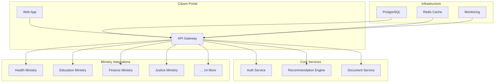

# ADE - Smart Government Ecosystem

> Proactive Digital Government Platform with 18 Ministry Integrations

[](LICENSE)
[](https://www.typescriptlang.org/)
[](https://nestjs.com/)
[](https://react.dev/)
[](https://www.postgresql.org/)

## Overview

ADE (Smart Government Ecosystem) is an enterprise-grade digital government platform that unifies 18 ministry APIs into a single citizen-facing portal. It provides proactive service recommendations, real-time government data processing, and KVKK/GDPR-compliant data handling — all under one secure, monitored infrastructure.

## Architecture



## Key Features

- **18 Ministry API Integrations** — Unified gateway to Health, Education, Finance, Justice, and 14 additional ministries
- **Proactive Recommendation Engine** — Surfaces relevant government services to citizens before they need to search
- **Real-Time Data Pipeline** — Live government data synchronization with event-driven processing
- **Enterprise JWT Authentication** — Role-based access control (RBAC) with multi-factor support
- **KVKK / GDPR Compliance** — Full data privacy compliance with audit trails
- **Prometheus + Grafana Monitoring** — End-to-end observability across all services

## Technology Stack

| Layer | Technology |
|---|---|
| Backend API | NestJS 10, TypeScript |
| Frontend | React 19, TypeScript |
| Database | PostgreSQL 15, Prisma ORM |
| Caching | Redis 7 |
| State Management | Zustand |
| Data Fetching | TanStack Query |
| Monitoring | Prometheus, Grafana |
| Container | Docker, Docker Compose |

## Project Structure

```
ade.ailydian.com/
├── backend/              # NestJS API server
│   ├── src/
│   │   ├── auth/         # JWT + RBAC authentication
│   │   ├── ministries/   # 18 ministry integration modules
│   │   ├── recommendations/ # Proactive service engine
│   │   ├── documents/    # Document management service
│   │   └── prisma/       # Database layer
├── frontend/             # React 19 citizen portal
│   ├── src/
│   │   ├── components/   # UI component library
│   │   ├── pages/        # Application routes
│   │   └── stores/       # Zustand state management
├── infrastructure/       # IaC and deployment configs
│   ├── prometheus/       # Metrics collection
│   └── grafana/          # Dashboard definitions
└── docker-compose.yml    # Local development stack
```

## Getting Started

### Prerequisites

- Node.js 20+
- pnpm 8+
- PostgreSQL 15
- Redis 7
- Docker (optional)

### Installation

```bash
# Clone the repository
git clone https://github.com/lydianai/ade.ailydian.com.git
cd ade.ailydian.com

# Install dependencies
pnpm install

# Configure environment variables
cp backend/.env.example backend/.env
cp frontend/.env.example frontend/.env

# Run database migrations
pnpm --filter backend prisma migrate dev

# Start development servers
pnpm dev
```

### Docker Quick Start

```bash
docker compose up -d
```

The citizen portal will be available at `http://localhost:3000` and the API at `http://localhost:4000`.

## Environment Variables

### Backend

| Variable | Description | Required |
|---|---|---|
| `DATABASE_URL` | PostgreSQL connection string | Yes |
| `REDIS_URL` | Redis connection string | Yes |
| `JWT_SECRET` | JWT signing secret (min 64 chars) | Yes |
| `JWT_REFRESH_SECRET` | Refresh token signing secret | Yes |
| `MINISTRY_API_BASE_URL` | Base URL for ministry APIs | Yes |
| `MINISTRY_API_KEY` | Ministry integration API key | Yes |
| `KVKK_COMPLIANCE_MODE` | Enable KVKK data controls | Yes |

### Frontend

| Variable | Description | Required |
|---|---|---|
| `NEXT_PUBLIC_API_URL` | Backend API endpoint | Yes |
| `NEXT_PUBLIC_WS_URL` | WebSocket server URL | Yes |

## Ministry Integrations

The platform integrates with 18 government ministry APIs through a unified adapter pattern:

1. Ministry of Health (Saglik Bakanligi)
2. Ministry of National Education (Milli Egitim)
3. Ministry of Treasury and Finance (Hazine ve Maliye)
4. Ministry of Justice (Adalet)
5. Ministry of Interior (Icisleri)
6. Ministry of Foreign Affairs (Disisleri)
7. Ministry of Environment (Cevre)
8. Ministry of Agriculture (Tarim)
9. Ministry of Industry and Technology (Sanayi ve Teknoloji)
10. Ministry of Energy (Enerji)
11. Ministry of Transport (Ulastirma)
12. Ministry of Trade (Ticaret)
13. Ministry of Culture and Tourism (Kultur ve Turizm)
14. Ministry of Labour (Calisma)
15. Ministry of Family (Aile)
16. Ministry of Youth and Sports (Genclik ve Spor)
17. Ministry of Defense (Milli Savunma)
18. Higher Education Council (YOK)

## Security

See [SECURITY.md](SECURITY.md) for the vulnerability reporting policy.

- All API endpoints protected with JWT + RBAC
- KVKK and GDPR compliant data processing
- AES-256 encryption at rest, TLS 1.3 in transit
- Regular automated dependency vulnerability scanning
- OWASP Top 10 mitigations applied

## License

Copyright (c) 2024-2026 Lydian (AiLydian). All Rights Reserved.

This is proprietary software. See [LICENSE](LICENSE) for full terms.

---

Built by [AiLydian](https://www.ailydian.com)
